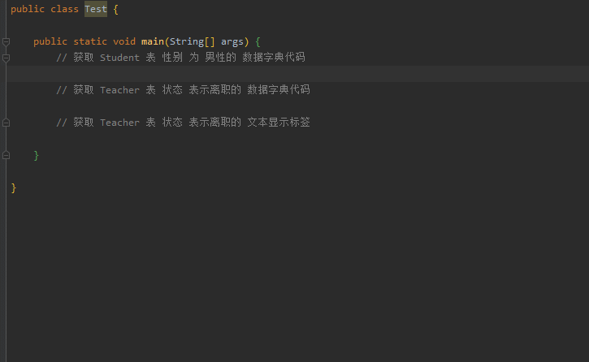
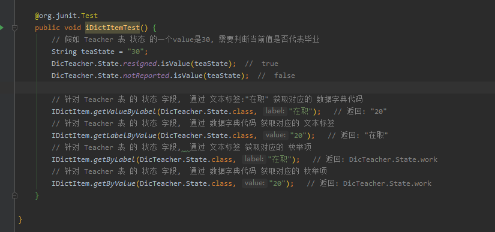

# code-dict

## 描述

一个简单的通用的数据字典框架

0. **减少了枚举类的代码, 将枚举作为一个代理入口使用, 将原本枚举中的方法和字段都提取到了统一的类中**.

1. **使用简单方便**, 用到一张表的某个含有数据字典的字段的时候, 能够根据IDE的代码提示轻松获取字段的各个信息.

2. **防止出错, 易于维护**, 因为使用的是枚举, 使用的时候不容易出错, 而且如果改动了字典表的值只需要更改对应的枚举类即可.

3. **统一格式, 增添功能**, 一般来说枚举中都会需要使用到一些统一的方法, 例如通过value获取label, 通过label获取value, 或者多选字段的值转换, 类似于这种统一的方法就可以通过在 `IDictItem` 接口中增删方法来调整整体的功能.
    
4. **方便为单个字段添加额外逻辑**, 因为使用的是枚举类, 所以只需要在字段对应的枚举类中添加方法就能很方便的使用和管理字段的处理逻辑.

> 原理: [巧用枚举让字典表的管理和使用变得简单, 优雅](https://blog.csdn.net/u011511756/article/details/88094754)

## [sonatype-Repository](https://search.maven.org/artifact/com.github.cpfniliu/code-dict/1.0/jar)

1. Apache Maven

    ```xml
    <dependency>
      <groupId>com.github.cpfniliu</groupId>
      <artifactId>code-dict</artifactId>
      <version>1.0</version>
    </dependency>
    ```

2. Gradle Groovy DSL

    ```yml
    implementation 'com.github.cpfniliu:code-dict:1.0'
    ```

## 使用枚举来管理数据字典

假如有两张表(简单一点, 一些非空, 长度什么的就不写了), 两个表都有 `gender` 和 `state` , `gender` 字典项相同, 但 `state` 字典项不同

1. 学生表 Student

    | 字段名(field) | 类型    | 字典项                                              |
    | ------------- | ------- | --------------------------------------------------- |
    | stuNo         | INTEGER |                                                     |
    | name          | VARCHAR |                                                     |
    | gender        | VARCHAR | 性别 : {男:1, 女:2}                                     |
    | state         | VARCHAR | 状态 : {未报到:10, 在读:20, 毕业:30, 结业:40, 肄业:50, 退学:60, 开除:70} |

2. 教师表 Teacher

    | 字段名(field) | 类型    | 字典项                            |
    | ------------- | ------- | --------------------------------- |
    | teaNo         | INTEGER |                                   |
    | name          | VARCHAR |                                   |
    | gender        | VARCHAR | 性别 : {男:1, 女:2}                   |
    | state         | VARCHAR | 状态 : {未报到:10, 在职:20, 离职:30, 开除:40} |

然后你就可以分别为两个表建立一个数据字典接口(之所以用接口是因为里面不需要有成员属性), 用来管理数据字典. 相关代码如下

1. 学生接口

```java
import com.github.codedict.core.IDictItem;
import com.github.codedict.core.StaticDictPool;

/**
 * <b>Description : </b> 学生数据字典接口
 *
 * @author CPF
 * @date 2019/12/13 10:43
 **/
public interface DicStudent {

    /**
     * 性别 : {男:1, 女:2}
     */
    enum Gender implements IDictItem {

        man("1", "男"), woman("2", "女");

        Gender(String value, String label) {
            StaticDictPool.putDictItem(this, value, label);
        }
    }

    /**
     * 状态
     */
    enum State implements IDictItem {

        notReported("10", "未报到"),
        reading("20", "在读"),
        graduation("30", "毕业"),
        defamation("40", "肄业"),
        completion ("50", "肄业"),
        withdrawal("60", "退学"),
        expulsion("70", "开除");

        State(String value, String label) {
            StaticDictPool.putDictItem(this, value, label);
        }
    }
}
```

2. 教师接口

```java
import com.github.codedict.core.IDictItem;
import com.github.codedict.core.StaticDictPool;

/**
 * <b>Description : </b> 教师数据字典接口
 *
 * @author CPF
 * @date 2019/12/13 10:43
 **/
public interface DicTeacher {

    /**
     * 性别 : {男:1, 女:2}
     */
    enum Gender implements IDictItem {

        man("1", "男"), woman("2", "女");

        Gender(String value, String label) {
            StaticDictPool.putDictItem(this, value, label);
        }
    }

    /**
     * 状态
     */
    enum State implements IDictItem {

        notReported("10", "未报到"),
        work("20", "在职"),
        resigned("30", "离职"),
        expelled("40", "开除");

        State(String value, String label) {
            StaticDictPool.putDictItem(this, value, label);
        }
    }
}
```

> 数据字典接口的标准格式:
> 1. 接口名称为 `Dic` + 表名.
> 2. 接口里面有多个枚举类, 每个枚举类对应表中有数据字典的字段. 枚举名是字段名的大写驼峰式字符串.
> 3. 每个枚举都实现了 `IDictItem` 接口, 枚举的每一个字典项对应字段的每一个数据字典项.

## 使用枚举管理数据字典的好处

1. **使用简单方便**, 用到一张表的某个含有数据字典的字段的时候, 能够根据IDE的代码提示轻松获取字段的各个信息.

    

2. **防止出错, 易于维护**, 因为使用的是枚举, 使用的时候不容易出错, 而且如果改动了字典表的值只需要更改对应的枚举类即可.

3. **统一格式, 增添功能**, 一般来说枚举中都会需要使用到一些统一的方法, 例如通过value获取label, 通过label获取value, 或者多选字段的值转换, 类似于这种统一的方法就可以通过在 `IDictItem` 接口中增删方法来调整整体的功能.

    
    
4. **方便为单个字段添加额外逻辑**, 因为使用的是枚举类, 所以只需要在字段对应的枚举类中添加方法就能很方便的使用和管理字段的处理逻辑.

    例如在开发中难免会遇到对于某个有数据字典的字段需要做一些单独的处理, 而这些处理逻辑直接写在代码里或者单独的类里面都不方便, 遇到这种情况就可以将此种逻辑写道对应的枚举类中.
    
    接下来说一个简单的示例: 例如就上面的教师类的Gender字段, 在内部使用的数据字典是`("1", "男"),("2", "女")`, 但是由于某种情况, 向外部进行推送的时候需要改成`("male", "男"),("female ", "女")`的格式, 这样的话就可以在枚举中添加两个方法就可以完方便解决.

```java
/**
 * 性别 : {男:1, 女:2}
 */
enum Gender implements IDictItem {

    man("1", "男"), woman("2", "女");

    Gender(String value, String label) {
        StaticDictPool.putDictItem(this, value, label);
    }

    public String innerToOuter(String val) {
        if (man.isValue(val)) {
            return "male";
        }
        if (woman.isValue(val)) {
            return "female";
        }
        throw new RuntimeException("转换出现异常");
    }
    
    String outerToInner(String val) {
        if ("male".equals(val)) {
            return man.value();
        }
        if ("female".equals(val)) {
            return woman.value();
        }
        throw new RuntimeException("转换出现异常");
    }
}
```

## TODO

### 按类别分开不同的 IDictItem

### 可配置的数据字典表解决方案

### 更好的支持多级数据字典
